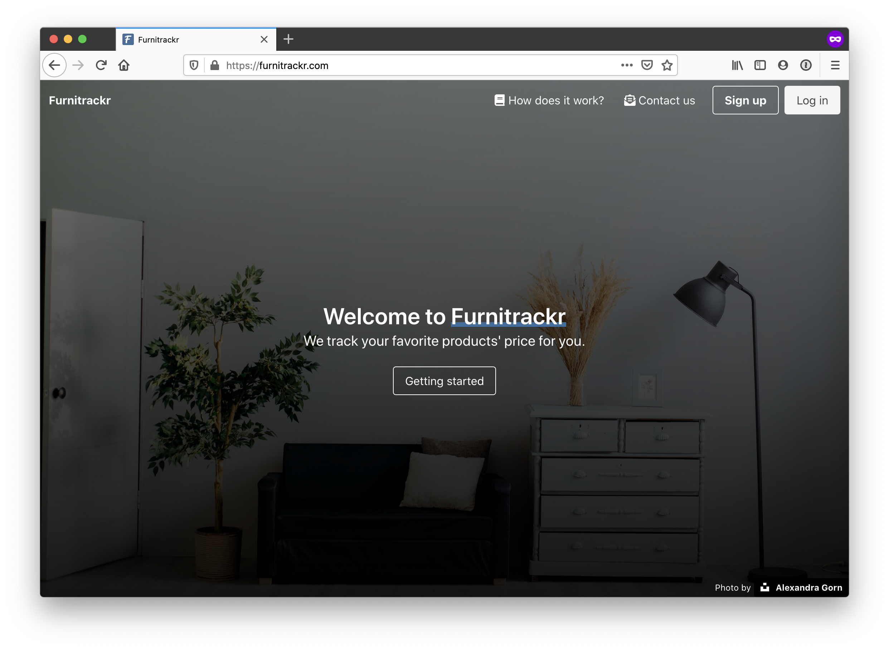
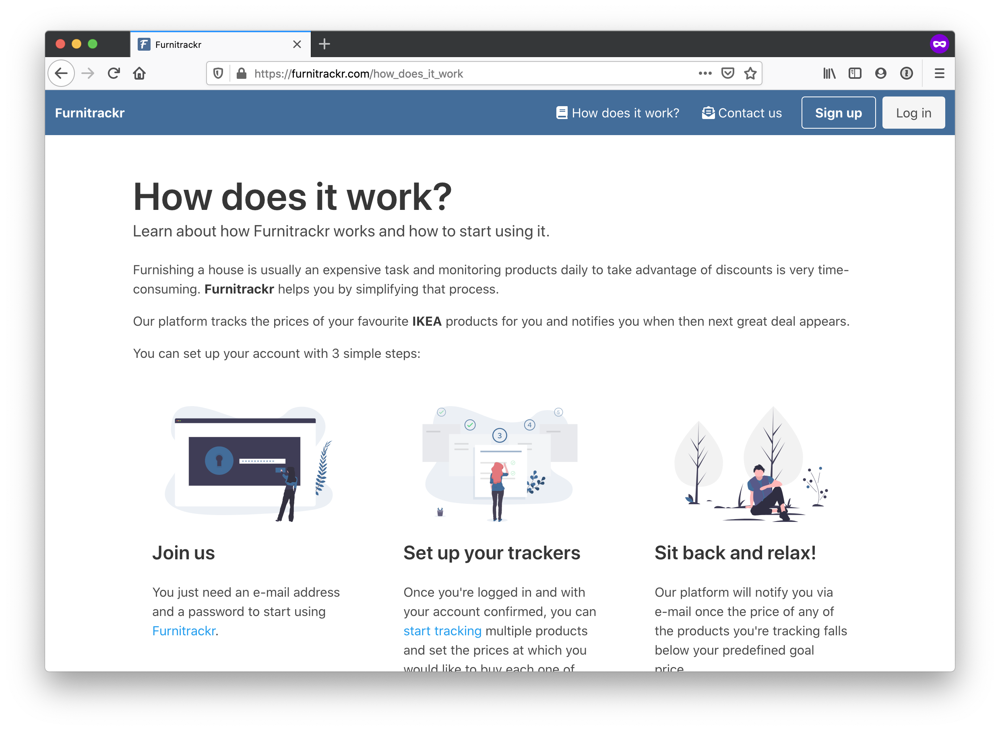
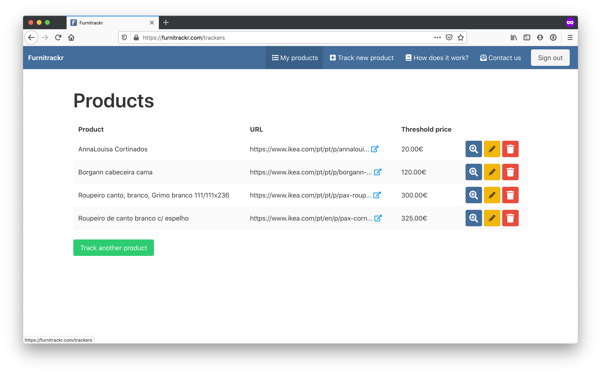
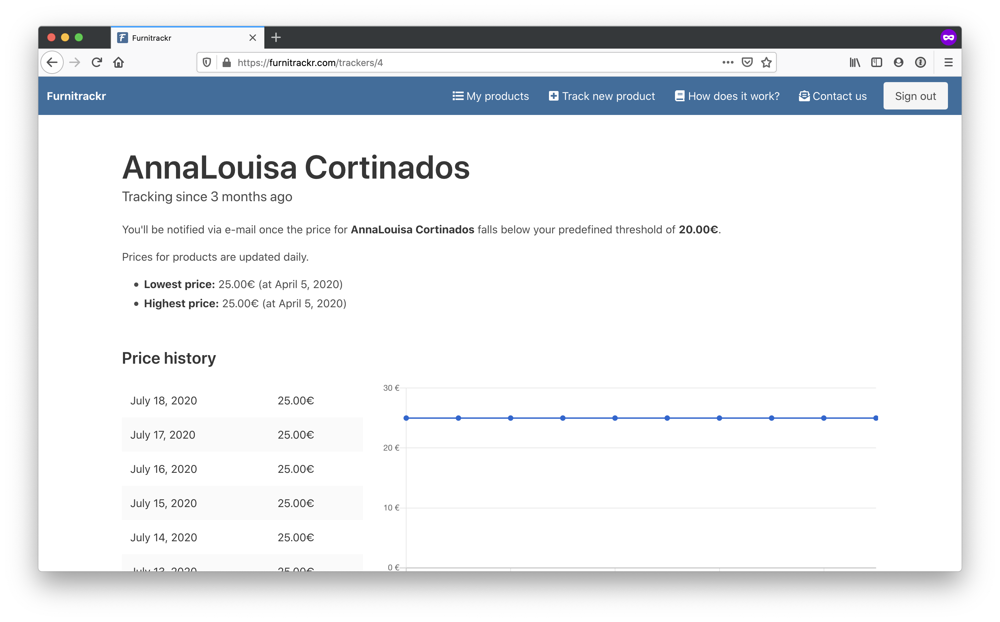

# Furnitrackr

[](https://app.codeship.com/projects/385596)

Furnitrackr is a price tracker for your products.

Any user may add an URL for a product, set a threshold price and be notified when the product's price falls below that predefined value.

## Versions

* Ruby version: 2.5.5
* PostgreSQL version: 12.0
* Ruby on Rails version: 6.0.2.1

## Running the project

```
$ bundle install
$ rails db:create db:migrate db:seed
$ rails s
```

At this point, you should be able to visit the application at `localhost:3000`.

## Testing

- Running the entire test suite: `rspec spec`

## Deployment instructions

In the future deploy to heroku.

## Screenshots

### Homepage



### How does it work?



### Trackers listing



### Product tracker detail


